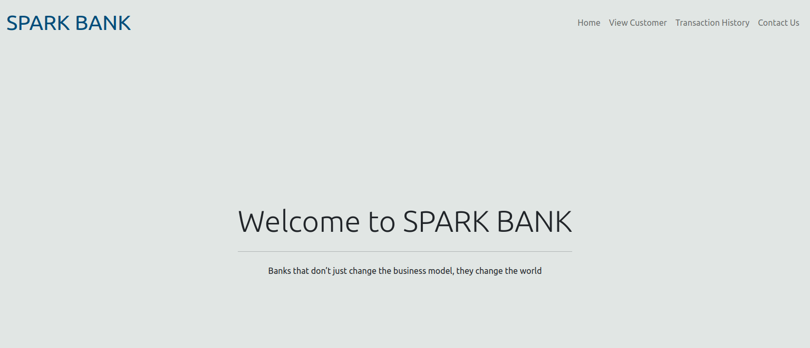
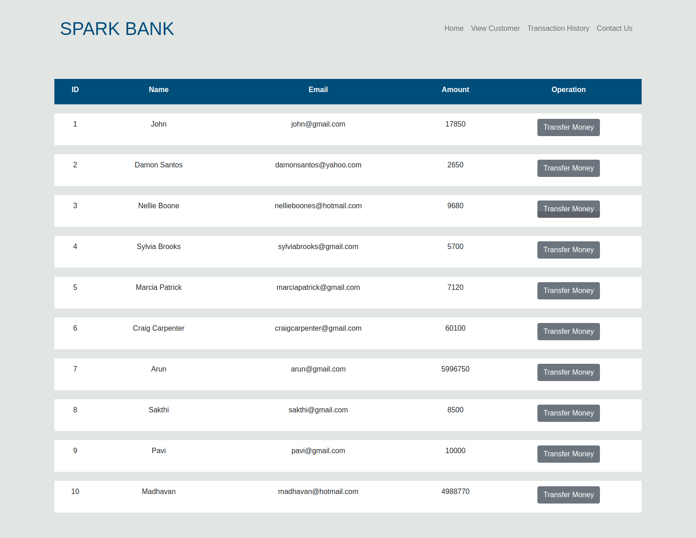
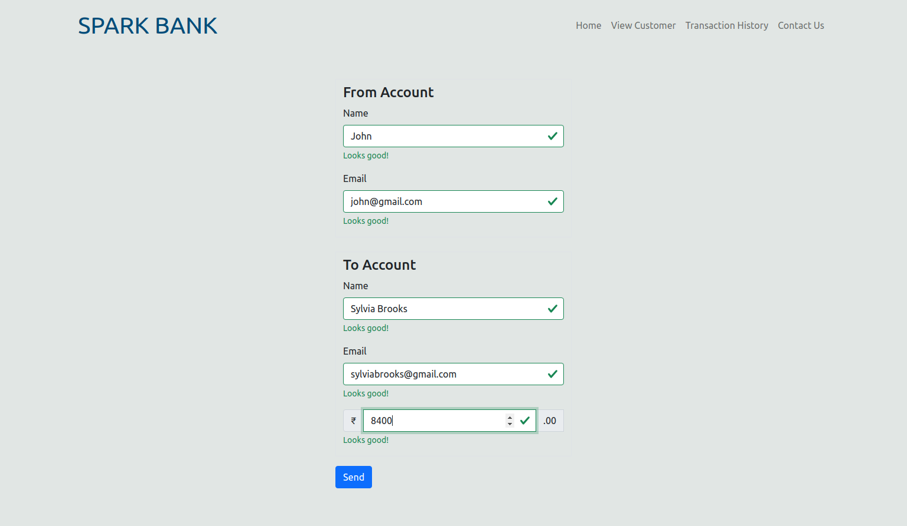
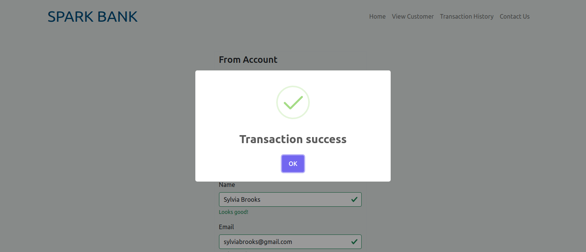
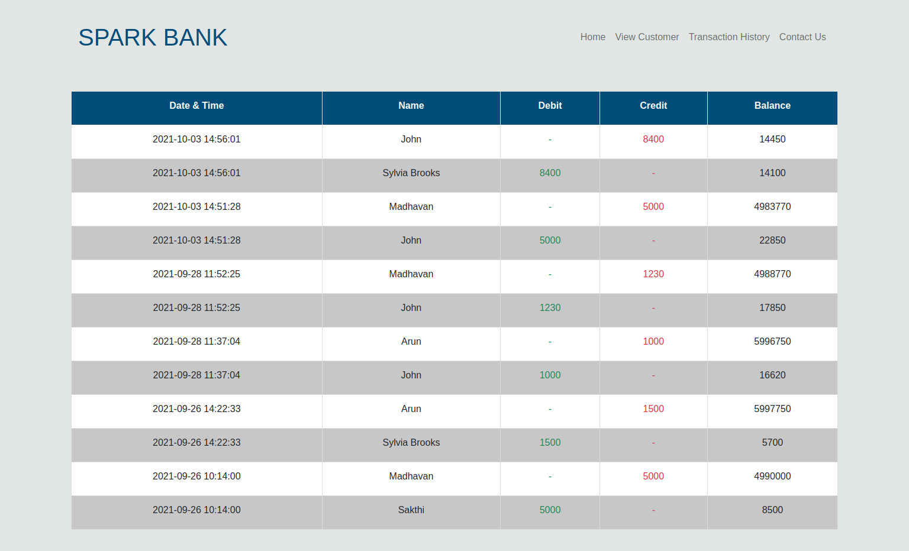
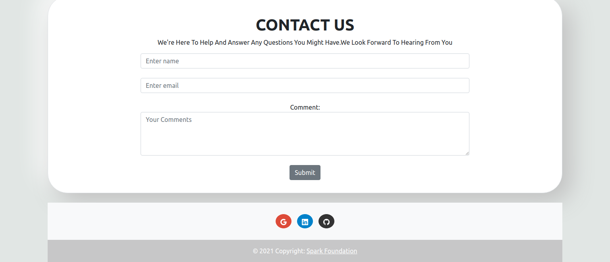

# Banking-System

## Introduction
>  ### The Sparks Foundation Internship Project - Basic Banking System
> A web application used to transfer money between two users.

## Technologies Used:
>  ### Front-End:
- HTML
- CSS
- Bootstrap 5
> ### Back-End:
-  PHP 
-  MYSQL

### Flow of the website
Home > View Customer > Select One Customer > Transfer Money > Select Receiver > View Customer

## Screenshots

